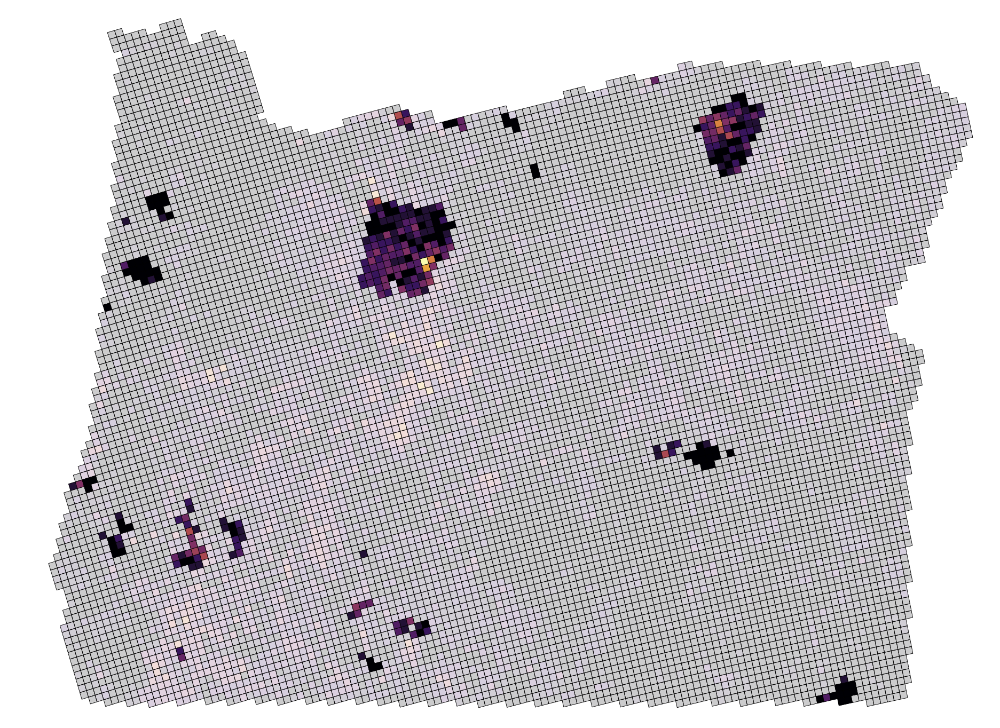
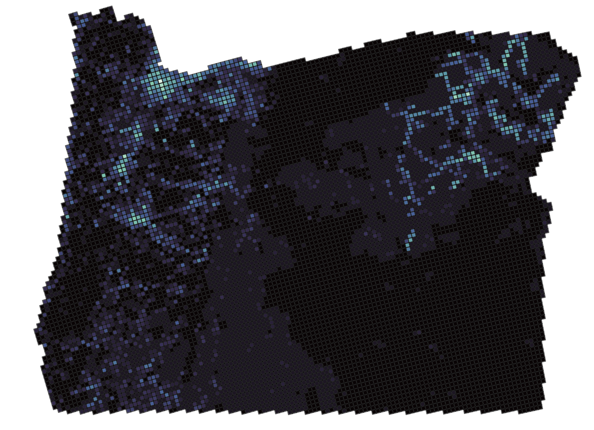

## The one-liner

We integrated publicly available ecological and geospatial biodiversity, historical vegetation, wildfire, and Indigenous land datasets into a statewide 5 km x 5 km geospatial dataset for Oregon so that Tribal governments, land managers, conservation organizations, and researchers can compare landscape-scale patterns in forest composition and wildfire severity to identify areas where further research may be warranted.

**Role:** \I led the project’s research design, data sourcing, analytical strategy, model validation, findings interpretation, and final communication, including substantial contributions to statistical and machine-learning analyses, formal reporting, and recommendations.\
**Team:** \ Spencer Fiden (https://github.com/sfiden)\
**Repo:** [github.com/asupancichmccord/Fiden-Supancich-McCord](https://github.com/asupancichmccord/Fiden-Supancich-McCord)

## The question

Wildfire is an increasing ecological and public-safety concern in Oregon, while Indigenous stewardship and prescribed fire are receiving renewed attention as potential components of wildfire resilience. We asked whether publicly available data showed meaningful differences in forest composition or wildfire severity characteristics across federally recognized Indigenous and non-Indigenous lands, and whether vegetation, previous fire history, or prescribed burns were associated with wildfire severity.

## The data

The project combined five major public data sources: LandMark for federally recognized Indigenous land boundaries, GBIF for species observations, Oregon Historic Vegetation for reconstructed historical vegetation, NIFC InFORM for fire occurrence and prescribed burns, and NIFC IFPH for wildfire perimeters. The sources ranged from 23,571 GBIF observations and 43,628 historical vegetation polygons to more than 1.2 million national InFORM records and 4,263 Oregon IFPH records. 

The hard part was not any single dataset—it was making datasets collected for different purposes work together. We standardized formats, dates, coordinate systems, and missing values; joined matching fire records between InFORM and IFPH; and handled incomplete fire-duration information without artificially imputing observations.

We then transformed the sources into a common 5 km × 5 km grid covering Oregon. Within each cell, we summarized plant occurrences, historical vegetation, Indigenous land designation, wildfire counts, maximum fire size and duration, prescribed burns, and fire history. This converted more than 70,000 individual observations into a standardized analytical dataset while retaining their spatial relationships.

{fig-alt="capstone map figure" width="90%"}

{fig-alt="capstone plant map figure" width="90%"}

## The approach

We approached the problem from three complementary angles.

First, we evaluated forest composition. We compared seven representative plant groups between Indigenous- and non-Indigenous-designated grid cells using Welch's t-tests, Mann-Whitney U tests as a sensitivity analysis, and Cohen's d to distinguish statistical significance from practical importance. We also calculated Shannon Diversity Index values and compared a baseline regression using plant abundance with a model that additionally included Indigenous land status. We used five-fold cross-validation and residual diagnostics to evaluate model performance.

Second, we compared wildfire characteristics. We examined wildfire counts, maximum acres burned, and maximum fire duration across land-designation categories, considering both all grid cells and exclusively cells that had experienced fires. We used effect sizes alongside statistical significance to assess whether observed differences were practically meaningful.

Third, we modeled wildfire size. Random Forest classifiers incorporated Indigenous land designation, vegetation characteristics, prescribed-burn history, and engineered measures of previous wildfire activity. Rolling and cumulative fire-history features were designed to use prior years rather than information from the target fire. We then used SHAP values to examine which variables contributed most to model predictions.

We kept the approach focused on reproducible, landscape-scale analysis rather than inferring causal effects from observational data. The resulting workflow provides a framework that can be extended with climate, topography, forest structure, standardized vegetation surveys, and more detailed prescribed-fire information.

## Findings

{fig-alt="capstone figure" width="90%"}

We found few consistent differences in plant abundance between Indigenous- and non-Indigenous-designated areas. Some individual species showed statistically significant differences, but significance varied depending on the statistical test, and observed differences were generally modest. The same pattern appeared in the overall diversity analysis. Adding Indigenous land status to a model based on plant abundance did not meaningfully improve prediction of Shannon diversity: the model's R² remained 0.233, and Indigenous status was not statistically significant (p = 0.769). Five-fold cross-validation produced an R² of 0.207, indicating only a modest decline in held-out performance.

Wildfire size and duration showed some distributional differences between land categories, but effect sizes were very small and did not support a meaningful overall difference in wildfire severity. In the Random Forest models, previous wildfire frequency and acreage consistently ranked among the strongest predictors of wildfire size, while vegetation characteristics also contributed substantially. Adding historical wildfire metrics improved model accuracy from 0.437 to 0.459, and separating the seven plant groups increased it further to 0.473—useful evidence of predictive signal, but still modest overall performance.

Cells with previous prescribed burns tended to have a greater proportion of smaller wildfire events. For 2020–2025, the association with maximum fire size was statistically significant (p = 0.001), but the effect remained small (Cohen's d = 0.19). This should not be interpreted as evidence that prescribed burning directly caused smaller wildfires. The analysis could not fully account for factors such as climate, vegetation, topography, ignition source, or the intensity and timing of prescribed burns. In addition, large fires intersecting multiple grid cells can appear as repeated cell-level observations.

## Discussion

The strongest signal in the data was not that Indigenous land designation itself determined biodiversity or wildfire severity. Instead, vegetation characteristics and previous fire history were more consistently associated with wildfire outcomes, while prescribed-burn history showed a smaller association with the distribution of fire sizes. The project also demonstrated that heterogeneous public ecological datasets can be combined into a reproducible statewide framework—but that framework remains constrained by incomplete fire records, uneven biodiversity observations, and the limited ecological information captured by the available datasets.

## Limitations & future work

Ecological metrics should be interpreted as proxies rather than comprehensive biodiversity measures. Analyses were limited to seven focal species, and GBIF observations are concentrated in more accessible, populated areas, creating geographic sampling bias. Further, the fire data exhibit missingness in individual records, and not all records exist across IFPH & InFORM, or align in reported values. It is also likely that prescribed burns that occurred in this scope were not officially recorded, as going through official channels may incur costs and legal ramifications. Future work should incorporate standardized biodiversity surveys, environmental variables, and collaboration with Tribal Nations.

## Ethics & responsible use

This project uses only publicly available ecological and geospatial datasets and contains no personally identifiable information (PII) or human subjects data. Sensitive metadata (e.g., observer names and tribal identifiers) are excluded from analysis and redistribution. To protect Indigenous communities, there is recognition that public datasets cannot fully represent Indigenous knowledge or stewardship practices and interpret results through the CARE (Collective Benefit, Authority to Control, Responsibility, Ethics) principles. Analyses are framed as observational, avoiding unsupported causal claims or generalizations across Indigenous nations. Landscape-level ecological patterns are reported rather than cultural conclusions and avoid deficit-based comparisons of land management systems. Findings are to be presented to support collaborative wildfire stewardship while respecting Indigenous rights and data sovereignty. See Data Invetory table in full write-up for explicit licensing details.

## The full write-up

[Download the write-up (PDF)](projects/capstone/writeup.pdf){.btn .btn-primary}

<iframe src="projects/capstone/writeup.pdf" width="100%" height="800px"
  style="border: 1px solid #ddd;"></iframe>

## Dig deeper

- 📦 **Code & pipeline:** [capstone-repo](https://github.com/Fiden-Supancich-McCord/data510-fire/tree/main)
- 📊 **Slides / poster:** \https://drive.google.com/file/d/1Gb-F29B0HOuR4Pgs4bNN8bUZPQu9E1QX/view?usp=sharing
